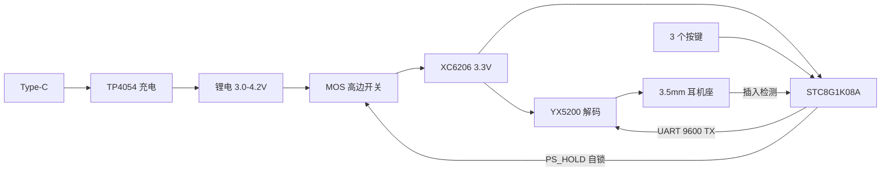

# dfplayermp3

[README.md](https://github.com/user-attachments/files/32387870/README.md)
# Pocket MP3 Player

基于 DFPlayer Mini 方案的超小型 MP3 播放器：锂电直供、3.5 mm 耳机输出、**3 个按键操控全部功能**，整机约 26 × 24 × 8 mm。


---

## 目录

- [特性](#特性)
- [硬件规格](#硬件规格)
- [系统架构](#系统架构)
- [按键操作](#按键操作)
- [仓库结构](#仓库结构)
- [快速开始](#快速开始)
- [关键设计取舍](#关键设计取舍)
- [制作路线](#制作路线)
- [已知限制](#已知限制)
- [路线图](#路线图)
- [许可证](#许可证)

---

## 特性

- **锂电直供**，不上升压也不降降压芯片 —— DFPlayer 宽压 3.2–5.5 V，电池 3.0–4.2 V 全程直接吃
- **DAC 直推耳机**，不加功放；官方手册建议串 100 Ω 限流
- **3 个按键出 12 个功能**：单击 / 双击 / 长按 / 双键组合四种手势
- **关机零静态电流**：P-MOS 硬断，不用模块自带的 sleep 命令（sleep 后仍耗十几毫安）
- **全贴片设计**，可以走嘉立创 SMT，不用手焊 0402
- **拔耳机自动暂停**（检测脚 + MCU 判定），省电

---

## 硬件规格

| 项目 | 参数 |
|---|---|
| 尺寸 | 26 × 24 mm，成品厚度约 8 mm（瓶颈是电池） |
| 解码芯片 | YX5200-24SS，SSOP-24 |
| 主控 | STC8G1K08A，SOP-8，内部晶振，串口下载 |
| 供电 | 单节锂聚合物，3.0–4.2 V 直供 |
| 稳压 | XC6206P332，SOT-23-3（压差 160 mV @ 50 mA） |
| 充电 | TP4054，SOT-23-5，PROG 10 kΩ → 100 mA |
| 电源开关 | AO3401A（P-MOS）+ AO3400A（N-MOS）软自锁 |
| 音频输出 | 3.5 mm 立体声座，DAC 直推 + 100 Ω 限流 |
| 存储 | microSD，FAT32，≤ 32 GB |
| 交互 | 3 个 3×4 mm 贴片轻触开关 |
| 播放电流 | 约 20–30 mA（含读卡） |
| 关机电流 | 接近 0 |

---

## 系统架构



电源链路刻意保持最短：电池 → P-MOS → LDO → 芯片。中间没有任何升压环节，这是能把厚度压到 8 mm 的主要原因。

---

## 按键操作

| 手势 | K1（左） | K2（中） | K3（右） |
|---|---|---|---|
| 单击 | 上一曲 | 播放 / 暂停 | 下一曲 |
| 双击 | 上一个文件夹 | 循环模式切换 | 下一个文件夹 |
| 长按 1.2 s | 音量 −（连发） | 开机 / 关机 | 音量 +（连发） |
| 双键组合 | K1+K2 电量播报 | K1+K3 音效 EQ | K2+K3 睡眠定时 |

判定窗口：单击在按下后 250 ms 内无第二击即触发；双击窗口 250 ms；长按 1.2 s 触发后每 200 ms 连发一次。

> 上表是**设计目标**。固件尚未编写，见[路线图](#路线图)。
> 不想做这么多的话，砍到 2 键也能有 6 个功能，1 键方案不建议 —— 误触率太高。

---

## 仓库结构

```
pocket-mp3/
├── README.md                      本文件
├── dfplayer-pocket-mp3-plan.html  完整设计方案（BOM / 电路 / 固件要点 / 结构 / 避坑）
├── board-netlist.html             元件表 + 逐脚网表 + 布局坐标 + 打样检查清单
└── kicad/
    ├── README.md                  PCB 文件的导入与修改说明
    ├── mp3-player.kicad_pcb       PCB 源文件（已摆位、已连网、待布线）
    ├── mp3-player.kicad_pro       KiCad 工程文件
    └── gen_pcb.py                 PCB 生成脚本，改参数后重跑即可
```

---

## 快速开始

**1. 准备 PCB**

```bash
cd kicad
python gen_pcb.py          # 可选：调整坐标或网络后重新生成
```

用 KiCad 8 打开 `mp3-player.kicad_pro`（打不开就直接用 `.kicad_pcb`）。

**2. 修改三处必改项**（详见 [`kicad/README.md`](kicad/README.md)）

- J1 TF 卡座脚位 —— 需要万用表量一块 DFPlayer 模块逆向
- U1 第 4 脚 VDD 的性质
- J2 耳机座、J3 Type-C 的引脚排列

**3. 布线并打样**

信号线 0.2 mm，3V3 走 0.4 mm，VBAT / VCC_SYS 走 0.5 mm；正反两面铺 GND，地过孔间距 ≤ 3 mm。
音频线平行等长、两侧包地，远离 SD 线和 VBAT。

导出 Gerber 后上传嘉立创下单：2 层、板厚 1.0 mm、有铅喷锡。26 × 24 mm 在 100 × 100 mm 里能拼 3×3。

---

## 关键设计取舍

**为什么不上稳压？** DFPlayer 标称 3.2–5.5 V，实测 3.3 V 以上稳定。锂电的可用区间 3.0–4.2 V 几乎完全落在里面，加升压纯属浪费体积和效率。

**为什么不用 sleep 命令关机？** 模块的休眠命令执行后仍要吃十几毫安，小电池几天就放光。所以用 P-MOS 做高边开关，配合 MCU 的 PS_HOLD 自锁：按键按下经二极管拉低栅极开机，MCU 起来后接管，关机时拉低 PS_HOLD 彻底断电。

**为什么按键不用 ADC 电阻链？** 电阻键盘里两键同按是并联关系，并联阻值容易和单键档位撞车，双击和组合键会变得不可靠。3 个键各占一个 IO，全部交给软件判断，最稳。

---

## 制作路线

建议分两版，别一上来就压厚度：

| 版本 | 做法 | 厚度 | 风险 |
|---|---|---|---|
| 第一版 | 画一块 26×24 mm 主板，DFPlayer 模块剪掉排针焊死在板上（只连 VCC / GND / TX / DAC_L / DAC_R / BUSY 六根） | 约 12 mm | 极低，当天能出声 |
| 第二版 | YX5200 芯片直接上板，全贴片走嘉立创 SMT | 约 8 mm | 中，外围参数要照 datasheet |

两版的 MCU 固件通用，不用重写。

---

## 已知限制

发布前请务必读完这一节。

1. **TF 卡座到 YX5200 的脚位映射没有可靠资料。** 芯片级方案唯一查不到的信息。必须用万用表蜂鸣档量一块 DFPlayer Mini 模块，量出来再改网络。或者直接在嘉立创开源广场找现成工程 fork。
2. **U1 第 4 脚 VDD 的性质待确认。** 当前按「内部 LDO 输出、只接 1 µF 退耦」处理。
3. **J2 耳机座和 J3 Type-C 的封装是通用占位**，引脚排列各厂家差异很大。
4. **PCB 尚未布线。** 源文件里飞线已经标注了连接关系，布线需要手工完成。
5. **固件尚未编写。**
6. **未经过实物验证。** 目前是纸面设计，打样后需要实测确认。

---

## 路线图

- [x] 系统架构与方案设计
- [x] 元件选型与逐脚网表
- [x] PCB 封装与摆位（KiCad 源文件）
- [ ] TF 卡座脚位逆向确认
- [ ] PCB 布线
- [ ] 首次打样与实测
- [ ] MCU 固件：手势状态机、串口驱动、上电初始化
- [ ] 外壳设计（3D 打印）

---

## 许可证

MIT。设计文档、PCB 源文件与脚本均可自由使用、修改和商业用途，但不承担任何因使用本设计造成的损失。
